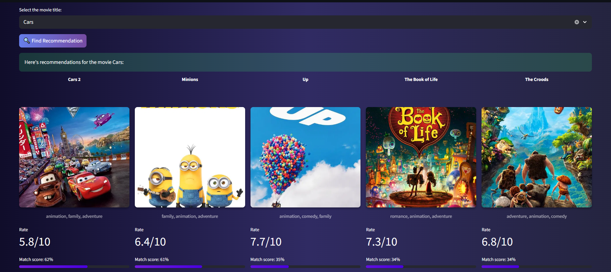

# 🎬 Content-Based Movie Recommendation System


## 📌 Project Overview

In the era of streaming wars, users face **"analysis paralysis"** due to content overload. This project builds a robust movie recommendation system designed to surface relevant content by analyzing metadata semantic similarities.

Unlike simple tag-matching systems, this engine employs a **Hybrid Logic** that considers semantic relevance, movie quality, popularity trends, and release recency. The result is a balanced, personalized discovery experience that avoids the common pitfalls of recommendation engines.

---

## 🚀 Live Demo & Resources

| Platform | Link | Description |
| :--- | :--- | :--- |
| **Streamlit App** | [](https://content-based-recommendation-system-for-movies-mr9raxrqxyopdb9.streamlit.app) | Explore the interactive dashboard and get recommendations. |
| **Hugging Face** | [](https://huggingface.co/Przemsonn/Recommendation_System) | Download the trained models (hosted externally due to size). |

---

## ⚙️ Methodology & Data Pipeline

### 1. Data Cleaning & Parsing
Data precision was paramount. We performed rigorous cleaning, including parsing complex stringified lists (e.g., converting `['Science', 'Fiction']` to `sciencefiction`). This "sanitization" step was crucial for the NLP model to treat multi-word genres and names as single, unique tokens, preventing semantic drift.

### 2. Exploratory Data Analysis (EDA)
EDA was not just a visualization step but a decision-making tool. It helped identify:
* **Outliers:** Movies with unrealistic runtimes (e.g., <15 mins) were imputed with median values.
* **Feature Selection:** We discarded low-variance features and identified the "Long Tail" distribution of movie popularity, which directly informed our log-transformation strategy.

### 3. Feature Engineering
We engineered several custom features to enhance model logic:
* **`weighted_rating`:** A Bayesian average that balances high ratings with vote counts. This promotes universally acclaimed movies while preventing niche films with a single 10/10 rating from dominating the leaderboard.
* **`movie_age`:** Calculated to penalize outdated content slightly, preventing the model from having a bias toward very old, less relevant films.
* **`tagline_integration`:** For movies with short overviews, we enriched the textual data by appending taglines, increasing the semantic signal for the NLP engine.

---

## 🧠 Model Architecture

### 🛡️ Baseline Model: The "Cold Start" Solution
Every recommendation system faces the **Cold Start problem**: *How to serve a user with no history?*

To solve this, I built a curatorial Baseline Model. Since simple averages are misleading, I applied a **Weighted Quality Score** to penalize low-confidence ratings. This ensures that default recommendations are statistically significant hits—mostly Action and Drama titles from the modern era (post-1990s)—aligning with the dataset's temporal distribution.

**Performance:**
The chart below confirms the model's effectiveness. The red dots (top recommendations) cluster in the upper-right quadrant, representing the ideal intersection of **High Popularity** and **High Quality**. This proves the model mitigates risk by suggesting "safe bets" to new users.


### 🚀 Main Model: The Hybrid Engine
Moving from static curation to dynamic retrieval, the Main Model uses **Natural Language Processing (NLP)**.
1.  **Metadata Soup:** We created a composite feature vector merging keywords, cast, director, and genres.
2.  **TF-IDF Vectorization:** Unlike simple counting, TF-IDF downweights generic terms (like "Action") and highlights unique descriptors, allowing the model to distinguish between a "Space Horror" and a "Space Comedy."

**The Hybrid Logic Formula:**
The final ranking isn't just about similarity. It uses a weighted formula to re-rank candidates:

$$Score = (W_{sim} \cdot Similarity) + (W_{qual} \cdot Quality) + (W_{pop} \cdot Popularity) - (W_{age} \cdot Age)$$

* **Similarity (50%):** Semantic relevance based on the Metadata Soup.
* **Quality (30%):** Ensures recommendations are actually *good* movies.
* **Popularity (10%):** Log-transformed to handle the "Long Tail" (surfacing hidden gems).
* **Age (-10%):** A slight penalty for age to combat "stale" recommendations while keeping classics alive via the Quality score.

---

## 📊 Performance & Evaluation

The model was stress-tested using a Monte Carlo simulation (50 samples, 20 iterations) to measure global health metrics.

| Metric | Result | Interpretation |
| :--- | :--- | :--- |
| **Quality (Avg Rating)** | **6.60 / 10** | **High Quality.** The model successfully filters out low-rated content (vs. global avg ~6.0). |
| **Diversity Index** | **0.72** | **High Exploration.** Recommendations are varied, avoiding "filter bubbles" where users see 10 identical movies. |
| **Genre Overlap** | **0.64** | **Solid Consistency.** 64% of recommendations share the primary genre, ensuring thematic relevance. |
| **Popularity Bias** | **1.51** | **Goldilocks Zone.** The system recommends movies 1.5x more popular than average—recognizable but not just top blockbusters. |


**Detailed Analysis:**
* **Quality (Top Left):** The model's recommendations (green area) shift slightly right of the database average (red line), indicating a preference for higher-quality films (6.5-7.0 range).
* **Diversity (Top Right):** A peak around 0.75-0.80 shows the model avoids monotony. It suggests varied content without descending into randomness.
* **Popularity Strategy (Bottom Right):** The curve shows a healthy bias towards popular content (values 0-2), but the "long tail" extending to 10 proves the model is capable of digging deep into the catalog for niche finds.

---

## 📲 App Interface & Usage

The project is deployed as an interactive web application.

**1. Movie Selection**
Users begin by selecting a movie from a database of ~4800 titles.


**2. Recommendation Engine**
The app displays 10 semantic recommendations. For each movie, you see:
* **Match %:** The hybrid score confidence.
* **Rating:** The weighted IMDB score.
* **Genres:** Top tags for context.
* **Poster:** Fetched dynamically via the TMDB API.




---

## 💡 Key Learnings & Future Work

**Learnings:**
* **NLP Power:** The "Metadata Soup" combined with TF-IDF is significantly more powerful than simple genre matching.
* **Feature Weighting:** The success of the model relied heavily on the custom weighting formula ($W_{sim}$, $W_{qual}$, etc.).
* **Data Hygiene:** Rigorous parsing during the cleaning phase prevented duplicate tokens and improved model precision.

**Future Improvements:**
* **GenAI Integration:** Upgrade the NLP layer using **BERT** or **LLMs** (like Llama/GPT) for semantic understanding beyond keyword matching.
* **Chatbot:** Add a conversational interface to ask for recommendations naturally (e.g., "I want a sad movie about robots").
* **Dockerization:** Containerize the application for easier deployment and scalability.

---

## 🛠️ Installation

```bash
# 1. Clone the repository
git clone [https://github.com/your-username/movie-recommender.git](https://github.com/your-username/movie-recommender.git)

# 2. Install dependencies
pip install -r requirements.txt

# 3. Run the analysis notebook
jupyter notebook Recommendation_System.ipynb

# 4. Run the Streamlit App locally
streamlit run app.py