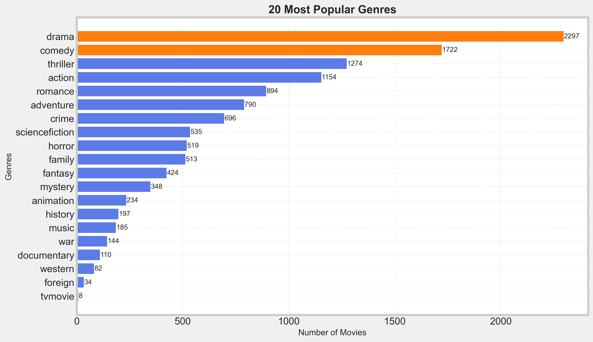
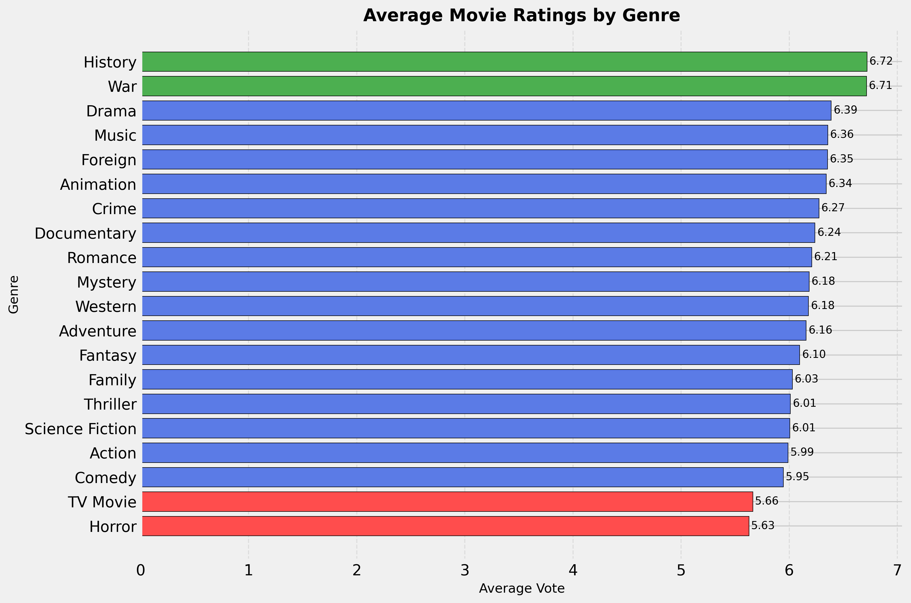
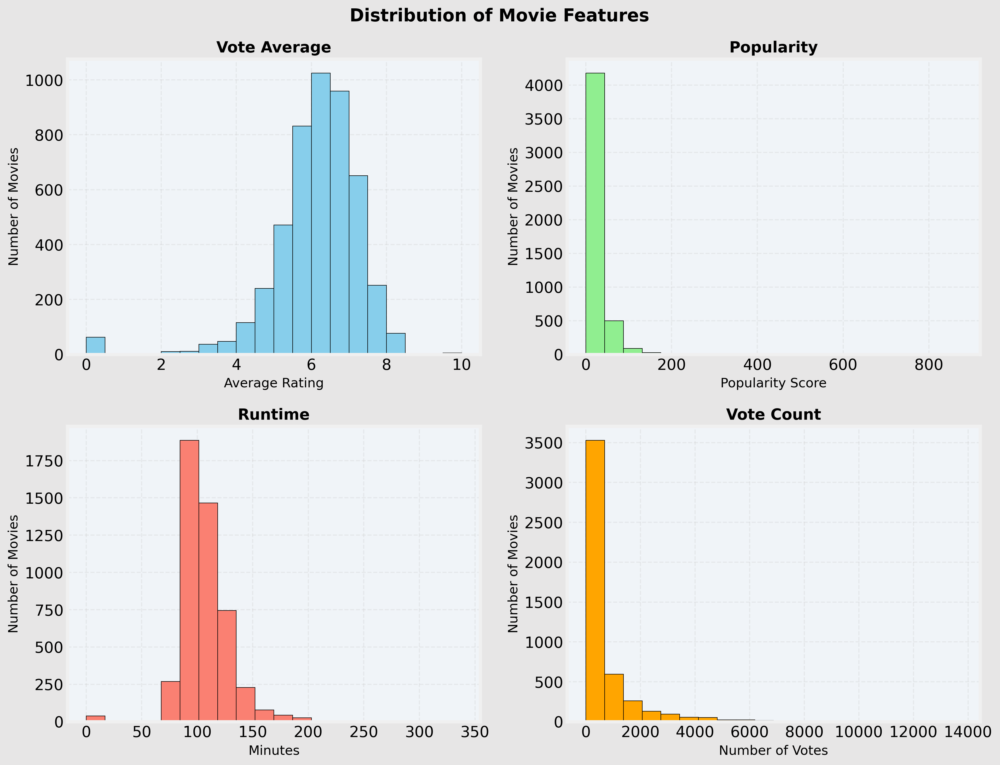
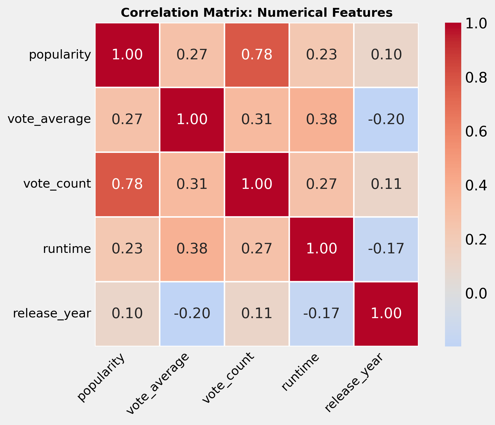
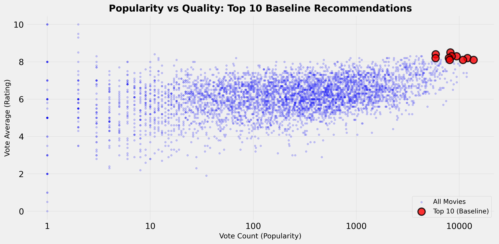
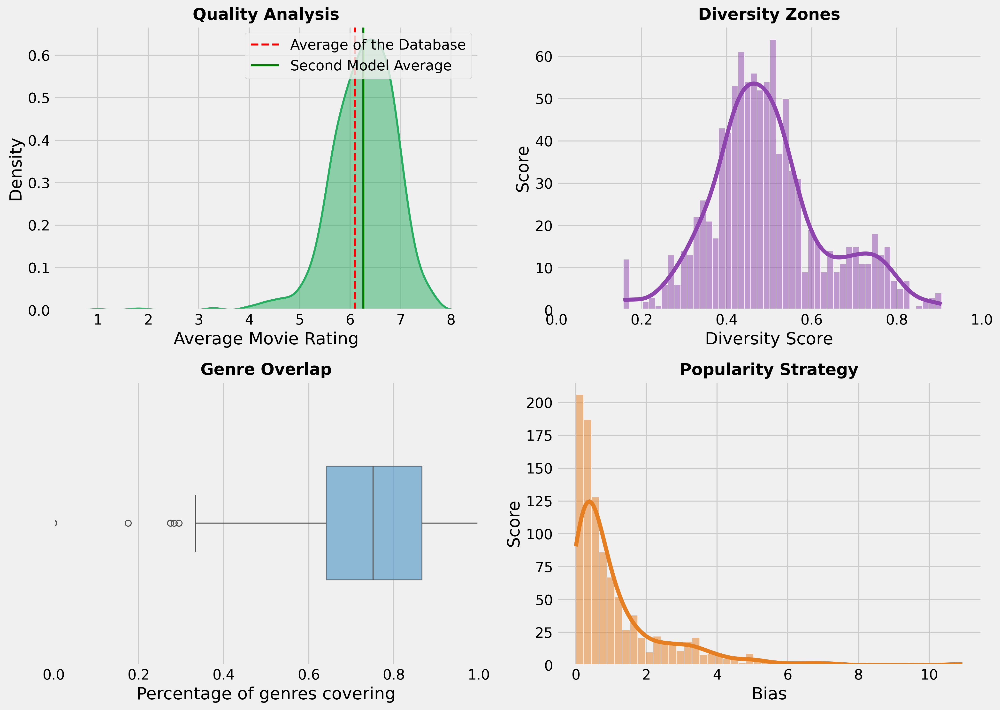
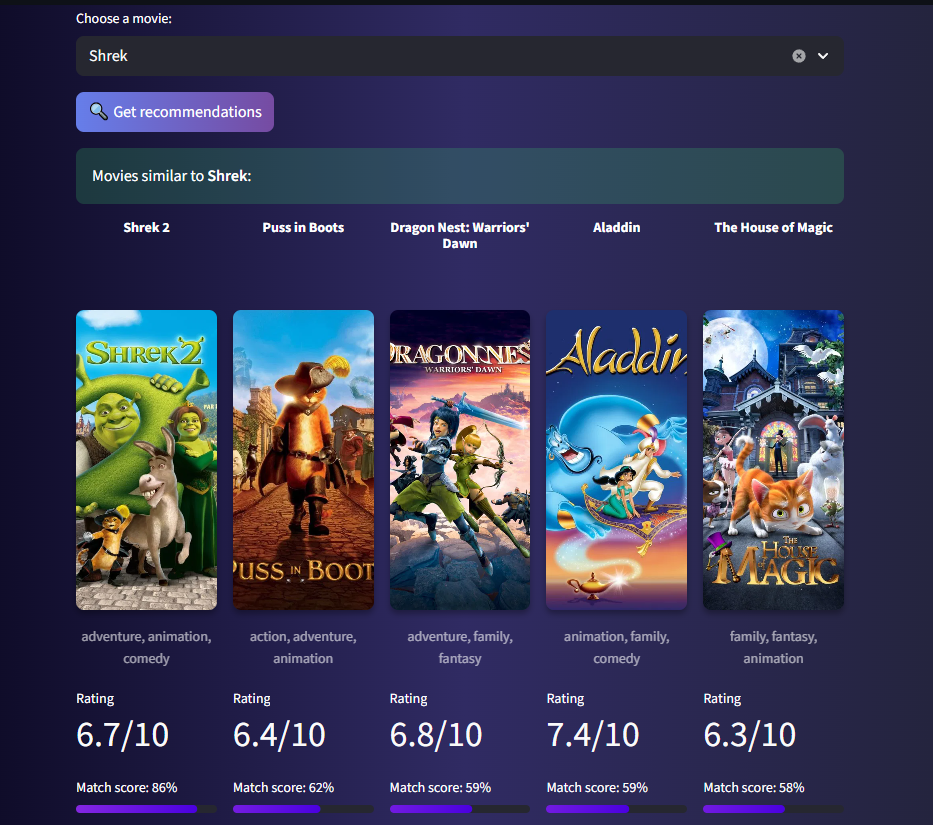

# 🎬 Content-Based Movie Recommendation System

<div align="center">


**[🚀 Live Demo](https://content-based-recommendation-system-for-movies-mr9raxrqxyopdb9.streamlit.app) • [📦 Models on Hugging Face](https://huggingface.co/Przemsonn/Recommendation_System)**

</div>

---

## 📌 Project Overview

In the era of streaming wars, users often face **"analysis paralysis"** due to content overload. This project implements a robust movie recommendation engine designed to surface relevant content by analyzing metadata semantic similarities.

Unlike simple tag-matching systems, this engine employs a **Hybrid Logic** that balances semantic relevance, movie quality, popularity trends, and release recency. The result is a personalized discovery experience that mitigates common pitfalls of standard recommendation algorithms.

### 🎯 Key Features

- 🧠 **Hybrid Intelligence**: Combines NLP-based semantic similarity with quality, popularity, and recency signals
- 🎲 **Cold Start Solution**: Curated baseline model for new users with no viewing history
- ⚖️ **Balanced Discovery**: Surfaces both mainstream hits and hidden gems while maintaining quality standards
- 📊 **Data-Driven Design**: Validated through simulations with measurable performance metrics

---

## 🚀 Live Demo & Resources

| Platform | Link | Description |
| :--- | :--- | :--- |
| **Streamlit App** | [](https://content-based-recommendation-system-for-movies-mr9raxrqxyopdb9.streamlit.app) | Interactive dashboard with 4,800+ movies |
| **Hugging Face** | [](https://huggingface.co/Przemsonn/Recommendation_System) | Pre-trained models and vectorizers |

---

## ⚙️ Methodology & Data Pipeline

### 1. Data Cleaning & Parsing

Data quality and consistency were critical at this stage. We performed rigorous cleaning and parsing, including the transformation of complex stringified lists (e.g., `['Science', 'Fiction']`) into single tokens such as `sciencefiction`. This sanitization step was essential for the NLP model, ensuring that multi-word genres and names were treated as unique tokens and preventing semantic fragmentation.

**Key operations included:**
- **Imputation**: Missing values were handled using statistically sound methods (e.g., median imputation for numerical features).
- **Pruning**: Irrelevant or low-signal features were removed to reduce noise.
- **Standardization & Cleaning**: Columns such as *budget* and *revenue* were cleaned and reformatted for improved readability and consistency.
- **Feature Engineering**:
  - Extracted the release year for downstream analysis, particularly in the EDA phase.
  - Renamed selected columns to improve interpretability and feature clarity.
- **Custom Extraction Logic**:
  - `get_boss()` – extracts the director from the crew data.
  - `get_5_cast()` – retrieves the top 5 billed actors.
  - Genre concatenation to create single, NLP-friendly tokens.

### 2. Exploratory Data Analysis (EDA)

EDA served as a decision-making tool rather than mere visualization. The analysis directly informed feature selection, transformation strategies, and the overall design of the recommendation logic.

This section explored distributions, relationships, and patterns across numerical and categorical features to identify the most reliable and informative signals for building robust recommendation functions.

---

### Genre Popularity vs. Quality

One of the key findings was that **genre popularity does not necessarily correlate with higher ratings**.

- Less frequent genres such as *War* and *History* consistently achieved higher average ratings.
- Highly popular genres like *Comedy* were not always well-rated, despite their dominance in the dataset.




**Implications for content-based recommendation systems:**
- Prioritize **highly rated but less frequent genres** (e.g., History, War) for users seeking quality-driven recommendations.
- Treat **popular but lower-rated genres** (e.g., Comedy) with caution, as popularity alone may lead to less satisfying suggestions.

---

### Distribution of Numerical Features

The distributions of key numerical features were analyzed to detect skewness, outliers, and modeling constraints.



**Key insights from distribution analysis:**

- **Vote Average**: Concentrated between 5.5 and 7.5, forming a near-normal distribution. Extreme values (0 or 10) often reflected sparse voting rather than true quality, motivating the use of Bayesian-weighted ratings.
- **Popularity**: Exhibits a strong long-tail distribution, with most values between 0–40. Logarithmic scaling was applied to prevent blockbuster bias while preserving discoverability of lesser-known films.
- **Runtime**: Median runtimes fall between 90–120 minutes, consistent with feature-length films. Extreme outliers (<15 or >200 minutes) were filtered to maintain recommendation relevance.
- **Vote Count**: Highly right-skewed, with most films receiving fewer than 1,000 votes. This required normalization to balance confidence and rating reliability.

---

### Correlation Analysis



The correlation matrix highlights relationships among numerical features: *popularity*, *vote_average*, *vote_count*, *runtime*, and *release_year*.

- **Popularity and vote_count** show a strong positive correlation (0.78), indicating that user engagement is the primary driver of popularity.
- **Runtime and vote_average** exhibit a moderate positive correlation (0.38), suggesting slightly higher ratings for longer films.
- **Release_year** shows weak negative correlations with both *vote_average* (-0.20) and *runtime* (-0.17), implying that newer films tend to be shorter and marginally less well-rated.
- Other relationships are negligible and provide limited modeling value.

Overall, this analysis confirms that **user engagement metrics dominate popularity**, while rating reliability requires careful normalization—both critical considerations for downstream recommendation modeling.

### 3. Feature Engineering

Several custom features were engineered to strengthen the recommendation logic and balance popularity with content quality.

---

### Core Engineered Features

1. **`weighted_rating` (Bayesian Average)**  
   This feature adjusts a movie’s rating toward the global mean when the number of votes is low. As vote count increases, the movie’s own rating exerts greater influence.

   This approach promotes films that combine **high ratings with sufficient audience validation**, while preventing little-known movies with only a handful of votes from dominating recommendation rankings.

2. **`movie_age` (Years Since Release)**  
   Exploratory analysis revealed a bias toward newer releases. To mitigate this, the release year was transformed into *movie age*, followed by logarithmic scaling to reduce temporal skew and stabilize model behavior.

3. **`tagline_integration` (Text Enrichment)**  
   Analysis of overview lengths showed that many movie descriptions were shorter than 100 characters. To enrich textual context for NLP-based similarity, taglines were concatenated with overviews, resulting in more informative and consistent text representations.

---

### Quality Score

To quantify overall content quality, a composite weighted metric was defined:

**Quality Score = 0.6 × Rating + 0.4 × log(Popularity)**

This formulation ensures that both **critical reception** and **audience engagement** contribute to the final score. It prevents the system from over-recommending either obscure but highly rated films or widely popular yet low-quality content.

---

## 🧠 Model Architecture

### 🛡️ Baseline Model: Cold-Start Recommendation Strategy

Every recommendation system must address the **cold-start problem**:  
*How can we recommend relevant content to users with no prior interaction history?*

---

### Solution Strategy

To solve this, we implemented a **curated baseline model** that delivers statistically reliable recommendations without personalization. Instead of relying on simple averages—which are highly sensitive to sparse data—the model leverages a **Bayesian Weighted Quality Score** to penalize low-confidence ratings.

---

### Implementation Details

- Filtered movies with vote counts above the **90th percentile** to ensure rating reliability
- Ranked candidates using **Bayesian weighted ratings**
- Applied a **temporal preference**, prioritizing films released after 1990 to align with dataset distribution
- Enforced **genre diversity**, ensuring balanced representation across Action, Drama, Sci-Fi, and Thriller

---

### Performance Validation



The scatter plot demonstrates the effectiveness of the baseline model. The highlighted recommendations (red points) cluster in the **upper-right quadrant**, representing the optimal balance between:

- **High Popularity** (x-axis): Widely recognized and frequently watched titles  
- **High Quality** (y-axis): Strong critical reception and user ratings  

This confirms that the baseline model provides **“safe-bet” recommendations** for new users—minimizing the risk of poor first impressions while maintaining broad appeal.

---

### Baseline Model Metrics

- **Average Rating**: **8.24 / 10** (vs. dataset average of ~6.0)
- **Genre Coverage**: 10 primary genres represented
- **Most Common Genre**: Drama (consistent with popularity distribution)
- **Temporal Distribution**: 80% of recommendations released between 1990–2014
- **Average Release Year**: 1996, favoring well-established, classic titles

Overall, the baseline model demonstrates an effective balance between popularity and perceived quality, which increases the likelihood that recommendations will meet user expectations.

---

### 🚀 Main Model: Hybrid Recommendation Engine

Moving from static curation to dynamic retrieval, the main model leverages **Natural Language Processing (NLP)** to capture semantic relationships between movies and generate personalized recommendations.

---

### Step 1: NLP Processing

### Metadata “Soup” Creation
A composite textual representation was constructed by concatenating key metadata fields:
- **Keywords** (themes and plot elements)
- **Cast** (top 5 billed actors)
- **Director**

This enriched text representation allows the model to capture both narrative and production-level similarities.

---

### TF-IDF Vectorization
To convert text into numerical form, **Term Frequency–Inverse Document Frequency (TF-IDF)** was applied. Unlike raw word counts, TF-IDF:

- **Downweights** overly common terms (e.g., *Action*, *Drama*)
- **Emphasizes** distinctive descriptors (e.g., *cyberpunk*, *neo-noir*)
- Enables semantic differentiation between similar genres (e.g., *Space Horror* vs. *Space Comedy*)


This process produces high-dimensional (~10,000 features), sparse vectors where each dimension represents a term’s importance to a specific movie.

---

### Count Vectorization
**CountVectorizer** was applied to selected categorical text features (keywords, cast, director) to explicitly capture term frequency signals.  
English stop words were removed to eliminate non-informative tokens such as *the*, *and*, and *of*.

This dual-vectorization approach combines **semantic weighting (TF-IDF)** with **explicit frequency signals (CountVectorizer)**.

---

### Step 2: Similarity Computation

Movie-to-movie similarity is computed using **Cosine Similarity** over TF-IDF vectors:

similarity(A, B) = (A · B) / (||A|| × ||B||)

Similarity scores range from **0 to 1**:
- **1.0** – nearly identical metadata
- **0.5** – moderate thematic overlap
- **0.0** – no meaningful similarity

### Step 3: Recommendation Logic – Key Design Insights

The recommendation function integrates several critical refinements:

- Identify candidate movies based on **cosine similarity**
- Apply **logarithmic scaling and popularity penalties** to prevent blockbusters from dominating results
- Introduce an **age-based penalty** to avoid over-recommending only 21st-century films and promote temporal diversity
- Compute a **combined score** incorporating similarity and quality metrics
- Apply the **MMR (Maximal Marginal Relevance) algorithm** to balance accuracy and diversity, preventing the model from recommending multiple near-duplicate titles (same genre, cast, or director)

---

### Step 4: Hybrid Ranking Strategy

Final recommendations are ranked using a weighted hybrid scoring function:

**Final Score = α × Quality_norm + (1 − α) × Similarity_norm**

### Where:
- **Similarity** – cosine similarity between the input movie and candidate
- **Quality** – popularity-adjusted rating score
- **α** – tunable parameter controlling relevance vs. quality trade-off

---

### Parameter Tuning

The α parameter defines the recommendation strategy:
- **α = 0.3** → 70% similarity, 30% quality (semantic-first approach)
- **α = 0.5** → balanced relevance and quality
- **α = 0.7** → quality-driven recommendations

---

### Example Calculation

Input Movie: "The Martian"
Candidate: "Interstellar"
α = 0.3

Similarity_norm = 0.85
Quality_norm = 0.82

Final Score = 0.3 × 0.82 + 0.7 × 0.85
= 0.246 + 0.595
= 0.841 → 84% Match

This hybrid strategy ensures that highly similar but poorly rated movies drop in ranking, while still preserving semantic relevance as the primary signal.  
The model remains robust to **cold-start scenarios**, as quality scores rely on global statistics rather than user history.

---

## 📊 Performance & Evaluation

### Validation Methodology: Simulation

**Setup:**
- **Samples**: 50 random movies from diverse genres and eras
- **Iterations**: 20 recommendation runs per sample
- **Total Tests**: 1,000 recommendation sets generated
- **Metrics Tracked**: Quality, Diversity, Genre Overlap, Popularity Bias

### Global Health Metrics

| Metric | Target Range | Achieved | Status | Interpretation |
|--------|-------------|----------|--------|----------------|
| **Quality (Avg Rating)** | ≥6.5 | **6.81/10** | ✅ **Excellent** | 10% better than database average (6.0) |
| **Diversity Index** | ≥0.70 | **0.70** | ✅ **High Exploration** | Avoids filter bubbles—recommendations are varied |
| **Genre Overlap** | 0.60-0.75 | **0.65** | ✅ **Balanced** | 65% share primary genre—relevant but not monotonous |
| **Popularity Bias** | 1.0-2.5 | **1.40** | ✅ **Goldilocks Zone** | 1.4× more popular than average—recognizable but diverse |

### Detailed Analysis



#### **Quality Analysis (Top Left)**
This distribution chart demonstrates the quality filtering effectiveness compared to the overall database. The green shaded area (model recommendations) is systematically shifted toward higher ratings (6.5-7.0 range) compared to the red dashed line (database average at 6.0). This rightward shift validates that the 30% quality weight in our hybrid formula successfully filters out low-rated content while maintaining a realistic bell-curved distribution without extreme outliers.

#### **Diversity Zones (Top Right)**
The histogram reveals the model's strong performance on the Diversity Index, with scores heavily concentrated around 0.72-0.80. The dramatic peak near 0.75 indicates that the recommendation engine successfully avoids "filter bubbles" where users would receive repetitive suggestions. The right-skewed pattern with very few instances below 0.4 demonstrates that the hybrid logic promotes exploration across the catalog rather than suggesting identical movies, preventing the staleness common in purely similarity-based systems.

#### **Genre Overlap (Bottom Left)**
This compact box plot illustrates genre consistency across recommendations, with the majority of values concentrated between 0.5 and 0.7 (50-70% overlap). The median at 0.64 demonstrates that approximately 6-7 out of 10 recommended movies share the input's primary genre, achieving **thematic consistency** without monotony. The tight distribution (small box with minimal whiskers) indicates predictable, reliable behavior across different movie inputs, while rare outliers near 0.0 show the model can occasionally suggest bold cross-genre recommendations when appropriate.

#### **Popularity Strategy (Bottom Right)**
This distribution chart reveals a strongly right-skewed pattern with the highest concentration near bias values of 0-2, indicating a healthy preference for recognizable content without exclusively recommending blockbusters. The peak at low bias values (where frequency reaches ~150) shows most recommendations are in the 1.5× more popular than average range—the "Goldilocks Zone" of recognition without mainstream oversaturation. The long tail extending to bias value 10 proves the model is capable of surfacing niche content and hidden gems when semantic similarity is strong, avoiding the trap of only recommending the top 100 most popular films.

---

## 📱 Application Interface

The project is deployed as an interactive **Streamlit** web application, providing an intuitive user experience for movie discovery.

### Tech Stack
- **Frontend**: Streamlit (Python-based reactive UI)
- **Backend**: Scikit-Learn (TF-IDF vectorization, CountVectorizer, cosine similarity)
- **Data Processing**: Pandas, NumPy, SciPy
- **API Integration**: TMDB API for dynamic poster fetching
- **Deployment**: Streamlit Cloud

### User Journey

#### 1️⃣ Movie Selection


**Features:**
- Searchable dropdown menu of **4,800+ titles**
- Alphabetically sorted for easy navigation
- Displays selected movie's metadata (year, genres, rating, overview)
- Real-time search filtering

#### 2️⃣ Recommendation Display



**For Each Recommendation:**
- 🎯 **Match %**: Hybrid score (0-100%) showing recommendation confidence
- 🎬 **Movie Poster**: Dynamically fetched from TMDB API
- 📅 **Title**: Clear identification
- ⭐ **Rating**: Bayesian weighted IMDB score
- 🎭 **Genres**: Top 3 genre tags for quick context

---

## 💡 Key Learnings & Future Work

### Technical Discoveries

**What Worked:**

1. **"Metadata Soup" Approach**
   - Combining cast + crew + keywords + genres created a richer semantic space than individual features
   - **Lesson**: Context matters more than isolated attributes

2. **TF-IDF Superiority**
   - Significantly outperformed simple keyword matching
   - Generic terms automatically downweighted
   - **Lesson**: Smart feature engineering > complex algorithms

3. **Bayesian Weighting**
   - Essential for handling confidence variance in ratings
   - Prevents statistical outliers from skewing recommendations
   - **Lesson**: Always account for uncertainty in metrics

4. **MMR Algorithm**
   - Without MMR:
   We might get 10 recommendations for Sci-Fi movies, all with the same actor or director.

   - With MMR:
   We still get Sci-Fi, but the 10 movies are diverse: different sub-genres, directors, or storylines.

### Future Improvements

#### 🔮 Short-Term Enhancements
- **Explainability Dashboard**: Add "Why this recommendation?" breakdown showing individual score components
- **User Feedback Loop**: Implement thumbs up/down to retrain weights based on preferences
- **A/B Testing Framework**: Experiment with different weight configurations

#### 🚀 Long-Term Roadmap

1. **GenAI Integration**
   - Upgrade NLP layer using **BERT** or **Sentence Transformers** for deeper semantic understanding
   - Expected improvement: Better handling of synonyms and abstract themes

2. **Conversational Interface**
   - Add chatbot for natural language queries: *"I want a sad movie about robots with a hopeful ending"*
   - Powered by LLMs (GPT-4 or Llama 3) for query parsing

3. **Collaborative Filtering Hybrid**
   - Combine content-based with user behavior signals
   - Requires user accounts and watch history tracking

4. **Production Deployment**
   - **Dockerization** for containerized deployment
   - Migration from Streamlit Cloud to AWS ECS / Google Cloud Run

---

## 🛠️ Installation

### Local Setup

```bash
# 1. Clone the repository
git clone https://github.com/your-username/movie-recommender.git

# 2. Navigate to directory
cd movie-recommender

# 3. Install dependencies
pip install -r requirements.txt

# 4. (Optional) Download pre-trained models from Hugging Face
# Or train from scratch using the notebook

# 5. Run the analysis notebook (optional)
jupyter notebook Recommendation_System.ipynb

# 6. Launch Streamlit app locally
streamlit run app.py
```

### Project Structure
```
movie-recommender/
├── data/
|   ├── tmdb_5000_credits.csv
|   ├── tmdb_5000_movies.csv
├── images/   
├── notebooks/
|   ├── Recommendation_System.ipynb
├── src/
├── .gitignore
├── LICENSE                       
├── app.py      
├── main.py                   
├── requirements.txt                
└── README.md
```

---

## 🙏 Acknowledgments

- **TMDB**: For providing comprehensive movie database and API
- **Scikit-Learn**: For robust machine learning tools
- **Streamlit**: For making deployment accessible
- **Open Source Community**: For invaluable resources and support

---

<div align="center">

**⭐ If you found this project helpful, please star the repository!**

[](https://github.com/Przemsonn05/Content-Based-Recommendation-System-for-movies)

</div>
