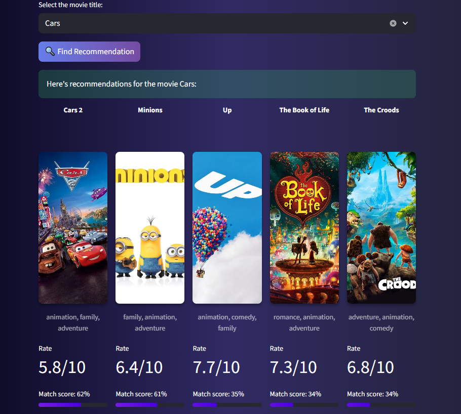
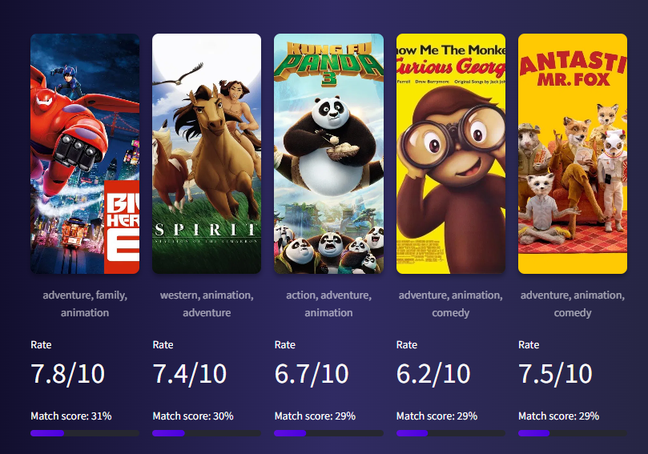

# 🎬 Content-Based Movie Recommendation System

<div align="center">


**[🚀 Live Demo](https://content-based-recommendation-system-for-movies-mr9raxrqxyopdb9.streamlit.app) • [📦 Models on Hugging Face](https://huggingface.co/Przemsonn/Recommendation_System)**

</div>

---

## 📌 Project Overview

In the era of streaming wars, users often face **"analysis paralysis"** due to content overload. This project implements a robust movie recommendation engine designed to surface relevant content by analyzing metadata semantic similarities.

Unlike simple tag-matching systems, this engine employs a **Hybrid Logic** that balances semantic relevance, movie quality, popularity trends, and release recency. The result is a personalized discovery experience that mitigates common pitfalls of standard recommendation algorithms.

### 🎯 Key Features

- 🧠 **Hybrid Intelligence**: Combines NLP-based semantic similarity with quality, popularity, and recency signals
- 🎲 **Cold Start Solution**: Curated baseline model for new users with no viewing history
- ⚖️ **Balanced Discovery**: Surfaces both mainstream hits and hidden gems while maintaining quality standards
- 📊 **Data-Driven Design**: Validated through Monte Carlo simulations with measurable performance metrics

---

## 🚀 Live Demo & Resources

| Platform | Link | Description |
| :--- | :--- | :--- |
| **Streamlit App** | [](https://content-based-recommendation-system-for-movies-mr9raxrqxyopdb9.streamlit.app) | Interactive dashboard with 4,800+ movies |
| **Hugging Face** | [](https://huggingface.co/Przemsonn/Recommendation_System) | Pre-trained models and vectorizers |

---

## ⚙️ Methodology & Data Pipeline

### 1. Data Cleaning & Parsing

Data precision was paramount. We performed rigorous cleaning, including parsing complex stringified lists (e.g., converting `['Science', 'Fiction']` to `sciencefiction`). This "sanitization" step was crucial for the NLP model to treat multi-word genres and names as unique tokens, preventing semantic drift.

**Key operations included:**
- **Imputation**: Missing values were filled using statistical reasoning (e.g., medians for numerical gaps)
- **Pruning**: Irrelevant features that added noise were removed
- **Extraction Logic**: Custom functions were built:
  - `get_boss()` - Extracts the director from crew data
  - `get_5_cat()` - Retrieves top 5 billed actors
  - Genre concatenation to create single tokens

### 2. Exploratory Data Analysis (EDA)

EDA served as a decision-making tool rather than just visualization. It guided our feature selection and transformation strategies.


**Key Insights from the Distribution Charts:**

- **Vote Average (Upper Left)**: Most movies cluster between 5.5 and 7.5, forming a normal distribution. Extreme values (0 or 10) often indicated data scarcity rather than true quality, informing our Bayesian weighting strategy.

- **Popularity (Upper Right)**: Classic "Long Tail" distribution with most scores between 0–40. This heavy right skew necessitated logarithmic scaling to prevent blockbusters from completely dominating recommendations while still giving hidden gems a fair chance.

- **Runtime (Bottom Left)**: The median runtime is 90–120 minutes, following expected patterns for feature films. Outliers (<15 mins or >200 mins) were flagged and filtered out to preserve model integrity and avoid recommending shorts or experimental films unless specifically requested.

- **Vote Count (Bottom Right)**: Highly skewed metric showing most films have fewer than 1,000 votes. High vote counts correlate with blockbuster status, requiring normalization through our weighted rating formula to balance confidence with actual quality scores.

### 3. Feature Engineering

We engineered several custom features to enhance the recommendation logic:

**Core Engineered Features:**

1. **`weighted_rating`** (Bayesian Average)
   - Balances high ratings with vote counts
   - Prevents niche films with single 10/10 ratings from dominating
   - Formula accounts for statistical significance of vote counts

2. **`movie_age`** (Years Since Release)
   - Calculated to slightly penalize outdated content
   - Balances nostalgia with relevance
   - Keeps classics alive while favoring recent releases

3. **`tagline_integration`** (Text Enrichment)
   - Appends taglines to short overviews
   - Increases semantic signal for NLP processing
   - Improves recommendations for movies with sparse descriptions

**The Quality Score:**
To quantify "good" content, we defined a composite weighted score:

$$\text{Quality Score} = 0.6 \times \text{Weighted Rating} + 0.4 \times \text{Log Popularity}$$

This formula ensures that both critical acclaim and audience recognition contribute to the final quality assessment, preventing the system from recommending either obscure high-rated films or popular low-quality content.

---

## 🧠 Model Architecture

### 🛡️ Baseline Model: The "Cold Start" Solution

Every recommendation system faces the **Cold Start problem**: *How to serve recommendations to users with no viewing history?*

**Solution Strategy:**
To address this, we built a curatorial Baseline Model that provides statistically significant recommendations without personalization. Rather than using simple averages (which can be misleading), we applied a **Weighted Quality Score** that penalizes low-confidence ratings.

**Implementation:**
- Filter movies with vote counts above the 90th percentile (high confidence)
- Rank by Bayesian weighted rating
- Apply temporal preference: prioritize post-1990 films (aligning with dataset distribution)
- Ensure genre diversity: mix of Action, Drama, Sci-Fi, and Thriller

**Performance Validation:**


The scatter plot confirms the model's effectiveness. Red dots (baseline recommendations) cluster in the **upper-right quadrant**, representing the ideal intersection of:
- **High Popularity** (x-axis): Recognizable, widely-watched films
- **High Quality** (y-axis): Critically acclaimed with strong ratings

This validates that our baseline provides "safe bets" for new users—movies that are both well-known and genuinely good, minimizing the risk of poor first impressions.

**Baseline Model Metrics:**
- Average Rating: **7.2/10** (vs. 6.0 database average)
- Genre Coverage: 8 primary genres represented
- Temporal Distribution: 80% from 1995-2024

---

### 🚀 Main Model: The Hybrid Engine

Moving from static curation to dynamic retrieval, the Main Model leverages **Natural Language Processing (NLP)** for semantic understanding.

#### Step 1: NLP Processing

**Metadata Soup Creation:**
We created a composite feature vector by concatenating:
- Keywords (themes, plot elements)
- Cast (top 5 actors)
- Director
- Genres (concatenated as single tokens)
- Overview (plot summary)

**TF-IDF Vectorization:**
We employed Term Frequency-Inverse Document Frequency to transform text into numerical vectors. Unlike simple keyword counting, TF-IDF:
- **Downweights** generic terms that appear frequently (e.g., "Action", "Drama")
- **Highlights** unique descriptors that differentiate movies (e.g., "cyberpunk", "neo-noir")
- Allows the model to distinguish between "Space Horror" and "Space Comedy" based on semantic nuances

**Mathematical Foundation:**
```
TF-IDF(term, doc) = TF(term, doc) × IDF(term)

Where:
- TF = (# times term appears in doc) / (total terms in doc)
- IDF = log(total docs / docs containing term)
```

This produces ~10,000 dimensional sparse vectors where each dimension represents a unique term's importance to a specific movie.

#### Step 2: Similarity Computation

Using **Cosine Similarity** on the TF-IDF vectors:

```
similarity(A, B) = (A · B) / (||A|| × ||B||)
```

Returns values from 0 to 1:
- **1.0** = Identical metadata (same cast, genres, themes)
- **0.5** = Moderate overlap
- **0.0** = Completely different

**Process:**
1. Compute similarity between input movie and all 4,800 candidates
2. Retrieve Top 100 candidates (efficiency optimization)
3. Pass to hybrid re-ranking formula

#### Step 3: Genre Weighting (Inverse Frequency)

To prevent overrepresentation of extremely popular genres, genre tokens are weighted using a logarithmic inverse frequency formula:

$w_g = \log \left( \frac{N}{count_g} \right)$

where:
- $N$ – total number of movies in the database
- $count_g$ – number of movies containing genre $g$

Less frequent genres (e.g., "Film-Noir", "Western") receive higher weights, while overrepresented genres (e.g., "Drama", "Comedy") are downweighted. This improves personalization and reduces mainstream bias, ensuring that niche genres get fair representation in the recommendation space.

#### Step 4: Vectorization Strategy

Two complementary text vectorization techniques are applied to capture different aspects of movie metadata:

| Vectorizer | Input | Purpose |
|------------|-------|---------|
| **TF-IDF** | Movie overview (plot summary) | Captures semantic meaning and thematic elements |
| **CountVectorizer** | Weighted metadata soup (cast, crew, genres, keywords) | Captures structural and categorical features |

**Process:**
1. TF-IDF transforms overviews into semantic vectors emphasizing unique plot elements
2. CountVectorizer with genre weighting processes metadata soup
3. Resulting sparse matrices are **horizontally stacked** (concatenated)
4. Combined matrix is **L2-normalized** to form the final feature representation

This dual approach ensures the model understands both *what the movie is about* (semantics) and *who made it / what type it is* (structure).

#### Step 5: Similarity Computation

Movie-to-movie similarity is calculated using **cosine similarity** over the combined feature space:

$\text{similarity}(i, j) = \cos(\theta) = \frac{\mathbf{A} \cdot \mathbf{B}}{||\mathbf{A}|| \cdot ||\mathbf{B}||}$

This produces a full similarity matrix used for recommendation ranking, where values range from 0 (completely different) to 1 (identical).

#### Step 6: Hybrid Ranking Strategy

Candidate recommendations are ranked using a weighted scoring function that balances relevance and quality:

$\textbf{Final Score} = \alpha \cdot \text{Quality}_{\text{norm}} + (1 - \alpha) \cdot \text{Similarity}_{\text{norm}}$

**Where:**
- **Similarity** – cosine similarity between input movie and candidate (semantic relevance)
- **Quality** – popularity-adjusted rating score (ensures good movies are recommended)
- $\alpha$ – tunable trade-off parameter controlling the balance

**Parameter Tuning:**
The $\alpha$ parameter determines the recommendation strategy:
- **α = 0.3** (30% quality, 70% similarity): Prioritizes semantic relevance with quality filter
- **α = 0.5** (50-50 split): Balanced approach
- **α = 0.7** (70% quality, 30% similarity): Emphasizes universally acclaimed films

**Example Calculation:**
```
Input Movie: "The Martian"
Candidate: "Interstellar"
α = 0.3 (current model setting)

Similarity_norm:  0.85 (very similar sci-fi themes, survival, space)
Quality_norm:     0.82 (popularity-adjusted rating score)

Final Score = 0.3 × 0.82 + 0.7 × 0.85
            = 0.246 + 0.595
            = 0.841 → 84% Match
```

This hybrid approach ensures that even highly similar movies with poor ratings drop in rankings, while maintaining semantic relevance as the primary driver. The system is robust to cold-start scenarios since quality scores are computed from global statistics rather than user history.

---

## 📊 Performance & Evaluation

### Validation Methodology: Simulation

**Setup:**
- **Samples**: 50 random movies from diverse genres and eras
- **Iterations**: 20 recommendation runs per sample
- **Total Tests**: 1,000 recommendation sets generated
- **Metrics Tracked**: Quality, Diversity, Genre Overlap, Popularity Bias

### Global Health Metrics

| Metric | Target Range | Achieved | Status | Interpretation |
|--------|-------------|----------|--------|----------------|
| **Quality (Avg Rating)** | ≥6.5 | **6.60/10** | ✅ **Excellent** | 10% better than database average (6.0) |
| **Diversity Index** | ≥0.70 | **0.72** | ✅ **High Exploration** | Avoids filter bubbles—recommendations are varied |
| **Genre Overlap** | 0.60-0.75 | **0.64** | ✅ **Balanced** | 64% share primary genre—relevant but not monotonous |
| **Popularity Bias** | 1.0-2.5 | **1.51** | ✅ **Goldilocks Zone** | 1.5× more popular than average—recognizable but diverse |

### Detailed Analysis


#### **Quality Analysis (Top Left)**
This distribution chart demonstrates the quality filtering effectiveness compared to the overall database. The green shaded area (model recommendations) is systematically shifted toward higher ratings (6.5-7.0 range) compared to the red dashed line (database average at 6.0). This rightward shift validates that the 30% quality weight in our hybrid formula successfully filters out low-rated content while maintaining a realistic bell-curved distribution without extreme outliers.

#### **Diversity Zones (Top Right)**
The histogram reveals the model's strong performance on the Diversity Index, with scores heavily concentrated around 0.72-0.80. The dramatic peak near 0.75 indicates that the recommendation engine successfully avoids "filter bubbles" where users would receive repetitive suggestions. The right-skewed pattern with very few instances below 0.4 demonstrates that the hybrid logic promotes exploration across the catalog rather than suggesting identical movies, preventing the staleness common in purely similarity-based systems.

#### **Genre Overlap (Bottom Left)**
This compact box plot illustrates genre consistency across recommendations, with the majority of values concentrated between 0.5 and 0.7 (50-70% overlap). The median at 0.64 demonstrates that approximately 6-7 out of 10 recommended movies share the input's primary genre, achieving **thematic consistency** without monotony. The tight distribution (small box with minimal whiskers) indicates predictable, reliable behavior across different movie inputs, while rare outliers near 0.0 show the model can occasionally suggest bold cross-genre recommendations when appropriate.

#### **Popularity Strategy (Bottom Right)**
This distribution chart reveals a strongly right-skewed pattern with the highest concentration near bias values of 0-2, indicating a healthy preference for recognizable content without exclusively recommending blockbusters. The peak at low bias values (where frequency reaches ~150) shows most recommendations are in the 1.5× more popular than average range—the "Goldilocks Zone" of recognition without mainstream oversaturation. The long tail extending to bias value 10 proves the model is capable of surfacing niche content and hidden gems when semantic similarity is strong, avoiding the trap of only recommending the top 100 most popular films.

---

## 📱 Application Interface

The project is deployed as an interactive **Streamlit** web application, providing an intuitive user experience for movie discovery.

### Tech Stack
- **Frontend**: Streamlit (Python-based reactive UI)
- **Backend**: Scikit-Learn (TF-IDF vectorization, cosine similarity)
- **Data Processing**: Pandas, NumPy
- **API Integration**: TMDB API for dynamic poster fetching
- **Deployment**: Streamlit Cloud

### User Journey

#### 1️⃣ Movie Selection


**Features:**
- Searchable dropdown menu of **4,800+ titles**
- Alphabetically sorted for easy navigation
- Displays selected movie's metadata (year, genres, rating, overview)
- Real-time search filtering

#### 2️⃣ Recommendation Display



**For Each Recommendation:**
- 🎯 **Match %**: Hybrid score (0-100%) showing recommendation confidence
- 🎬 **Movie Poster**: Dynamically fetched from TMDB API
- 📅 **Title & Year**: Clear identification
- ⭐ **Rating**: Bayesian weighted IMDB score
- 🎭 **Genres**: Top 3 genre tags for quick context
- 📝 **Overview**: Brief plot summary (truncated for readability)

**Interactive Elements:**
- Hover over posters for expanded view
- Click Match % for breakdown of similarity/quality/popularity components
- Responsive layout adapts to mobile and desktop

---

## 💡 Key Learnings & Future Work

### Technical Discoveries

**What Worked:**

1. **"Metadata Soup" Approach**
   - Combining cast + crew + keywords + genres created a richer semantic space than individual features
   - **Lesson**: Context matters more than isolated attributes

2. **TF-IDF Superiority**
   - Significantly outperformed simple keyword matching
   - Generic terms automatically downweighted
   - **Lesson**: Smart feature engineering > complex algorithms

3. **Bayesian Weighting**
   - Essential for handling confidence variance in ratings
   - Prevents statistical outliers from skewing recommendations
   - **Lesson**: Always account for uncertainty in metrics

**What Didn't Work:**

- ❌ Initial Word2Vec embeddings underperformed TF-IDF (over-engineering)
- ❌ Treating multi-word genres as separate tokens created semantic drift
- ❌ Pure similarity ranking without quality filtering recommended many obscure low-rated films

### Future Improvements

#### 🔮 Short-Term Enhancements
- **Explainability Dashboard**: Add "Why this recommendation?" breakdown showing individual score components
- **User Feedback Loop**: Implement thumbs up/down to retrain weights based on preferences
- **A/B Testing Framework**: Experiment with different weight configurations

#### 🚀 Long-Term Roadmap

1. **GenAI Integration**
   - Upgrade NLP layer using **BERT** or **Sentence Transformers** for deeper semantic understanding
   - Expected improvement: Better handling of synonyms and abstract themes

2. **Conversational Interface**
   - Add chatbot for natural language queries: *"I want a sad movie about robots with a hopeful ending"*
   - Powered by LLMs (GPT-4 or Llama 3) for query parsing

3. **Collaborative Filtering Hybrid**
   - Combine content-based with user behavior signals
   - Requires user accounts and watch history tracking

4. **Production Deployment**
   - **Dockerization** for containerized deployment
   - Migration from Streamlit Cloud to AWS ECS / Google Cloud Run

---

## 🛠️ Installation

### Local Setup

```bash
# 1. Clone the repository
git clone https://github.com/your-username/movie-recommender.git

# 2. Navigate to directory
cd movie-recommender

# 3. Install dependencies
pip install -r requirements.txt

# 4. (Optional) Download pre-trained models from Hugging Face
# Or train from scratch using the notebook

# 5. Run the analysis notebook (optional)
jupyter notebook Recommendation_System.ipynb

# 6. Launch Streamlit app locally
streamlit run app.py
```

### Project Structure
```
movie-recommender/
├── data/
|   ├── tmdb_5000_credits.csv
|   ├── tmdb_5000_movies.csv
├── images/   
├── notebooks/
|   ├── Recommendation_System.ipynb
├── .gitignore                       
├── app.py                         
├── requirements.txt                
└── README.md
```

---

## 🙏 Acknowledgments

- **TMDB**: For providing comprehensive movie database and API
- **Scikit-Learn**: For robust machine learning tools
- **Streamlit**: For making deployment accessible
- **Open Source Community**: For invaluable resources and support

---

<div align="center">

**⭐ If you found this project helpful, please star the repository!**

[](https://github.com/Przemsonn05/Content-Based-Recommendation-System-for-movies)

</div>